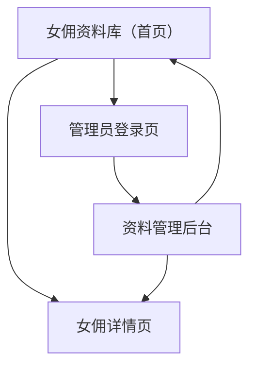

## 1. Product Overview
maid_system 是一个“女佣资料库 + 公开展示页”的小型系统，用于沉淀女佣核心档案并对外展示。
它对标并可接入现有站点 fdw-one.vercel.app 的展示需求：提供可直接访问/可嵌入的列表与详情页面（含 SEO/OG），并支持资料发布。

对接约定（用于 fdw-one.vercel.app）：
- 列表页：`/`，支持 `?embed=1`（嵌入模式：去掉右上角 Admin 入口、紧凑边距）
- 详情页：`/maids/:maidId`，支持 `?embed=1`
- 按 Ref/Code 跳转：`/m/:code` 或 `/maids/by-code/:code`，也可在列表页使用 `/?ref=:code`

## 2. Core Features

### 2.1 User Roles
| 角色 | 注册/登录方式 | 核心权限 |
|------|---------------|----------|
| 访客（公开用户） | 无需登录 | 浏览女佣列表、筛选搜索、查看女佣详情 |
| 管理员 | 邮箱 + 密码登录 | 新增/编辑/下架女佣资料、上传照片与PDF、发布/撤回 |

### 2.2 Feature Module
系统最小可用版本包含以下页面：
1. **女佣资料库（首页）**：筛选区、搜索、卡片列表、分页/加载更多。
2. **女佣详情页**：基础信息、技能与经历、附件（PDF/图片）、分享/复制链接。
3. **管理员登录页**：管理员登录、退出、会话失效处理。
4. **资料管理后台**：女佣资料 CRUD、上传管理（照片/PDF）、发布状态管理。

### 2.3 Page Details
| Page Name | Module Name | Feature description |
|-----------|-------------|---------------------|
| 女佣资料库（首页） | 顶部导航 | 显示站点名、返回首页入口；提供“管理员入口”（可隐藏/置底）。 |
| 女佣资料库（首页） | 筛选与搜索 | 按关键词搜索（姓名/编号/标签）；按国籍、可用状态、技能标签、薪资区间等筛选；支持一键清空。 |
| 女佣资料库（首页） | 列表展示 | 以卡片展示头像、姓名/编号、国籍、年龄、关键标签、可用状态；点击进入详情。 |
| 女佣资料库（首页） | 分页/加载 | 支持分页或加载更多；在筛选条件变化时重置到第一页。 |
| 女佣详情页 | 资料摘要 | 展示姓名/编号、头像、可用状态、更新时间；强调关键标签（如擅长项/语言）。 |
| 女佣详情页 | 核心字段区 | 展示基础信息（国籍/年龄/身高体重/宗教/语言）、薪资与休息日偏好、工作经历摘要。 |
| 女佣详情页 | 附件与媒体 | 浏览多张照片；查看/下载 biodata PDF（如有）；异常时提示“暂无附件”。 |
| 女佣详情页 | 分享与接入 | 复制当前详情页 URL；提供用于现有站点接入的“公开链接规范”（列表页/详情页）。 |
| 管理员登录页 | 登录表单 | 邮箱+密码登录；错误提示（账号不存在/密码错误/无权限）；登录后跳转后台。 |
| 管理员登录页 | 会话管理 | 退出登录；会话过期自动跳转登录并保留回跳地址。 |
| 资料管理后台 | 列表与检索 | 查看所有女佣（含草稿/已发布）；按编号/姓名搜索；按状态筛选。 |
| 资料管理后台 | 新增/编辑 | 创建与编辑女佣资料；表单校验（必填/数值范围/枚举）；保存草稿。 |
| 资料管理后台 | 上传与绑定 | 上传头像、相册图、PDF；将文件与女佣资料绑定；可替换/删除附件。 |
| 资料管理后台 | 发布流程 | 将草稿发布为公开可见；支持撤回（变为下架/不可见）；记录操作者与时间。 |

## 3. Core Process
- 访客流程：进入女佣资料库（首页）→ 使用搜索/筛选 → 点击卡片进入女佣详情 → 查看照片与PDF → 复制链接用于分享或在现有站点中引用。
- 管理员流程：打开管理员登录页 → 登录成功进入资料管理后台 → 新增/编辑女佣资料 → 上传照片/PDF → 保存草稿 → 发布后对外可见；如需下架则撤回。

