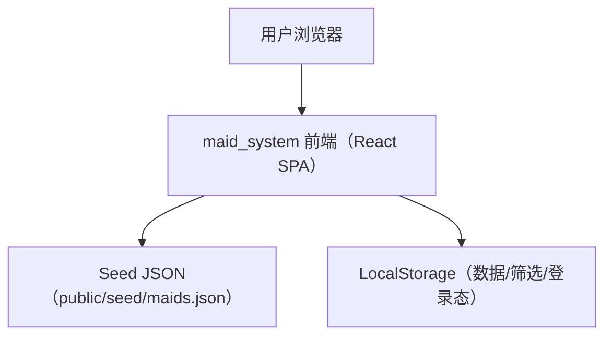
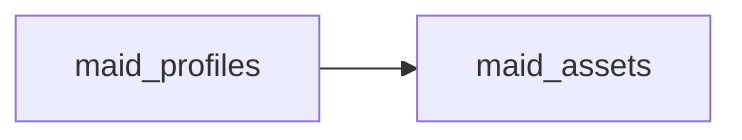

## 1.Architecture design

## 2.Technology Description
- Frontend: React@18 + vite + react-router + tailwindcss@3
- Persistence: LocalStorage（Zustand persist）
- Data source: 静态 Seed JSON（可通过后台导入/导出 JSON 迁移数据）

## 3.Route definitions
| Route | Purpose |
|-------|---------|
| / | 女佣资料库首页（搜索/筛选/列表） |
| /maids/:maidId | 女佣详情页（公开展示 + OG/SEO） |
| /admin/login | 管理员登录 |
| /admin | 后台入口（默认跳转 /admin/maids） |
| /admin/maids | 女佣资料管理（列表/新增/编辑/发布/撤回） |
| /admin/maids/:maidId | 单个女佣资料编辑（含上传与预览） |

## 6.Data model(if applicable)

### 6.1 Data model definition
核心实体（前端本地数据结构）：
- maid_profiles：女佣主档（公开字段 + 内部字段）
- maid_assets：简化为 URL 列表（照片 URLs / PDF URL），不做独立存储桶

建议核心数据字段（maid_profiles）：
- id（UUID）
- code（对外编号，字符串，唯一）
- name（姓名）
- avatar_url（头像URL，可为空）
- nationality（国籍）
- age（年龄）
- height_cm、weight_kg（身高体重，可为空）
- religion（宗教，可为空）
- languages（语言数组，如 ["English","Mandarin"]）
- skills（技能标签数组，如 ["Infant Care","Cooking"]）
- experience_summary（经历摘要，文本）
- years_experience（年限，可为空）
- expected_salary_sgd（期望薪资，可为空）
- rest_day_preference（休息日偏好，可为空）
- availability_status（枚举：available / reserved / unavailable）
- publish_status（枚举：draft / published）
- created_at、updated_at

建议核心数据字段（maid_assets）：
- id（UUID）
- maid_id（逻辑外键，指向 maid_profiles.id）
- type（枚举：photo / biodata_pdf）
- storage_path（Supabase Storage 路径）
- public_url（公开URL，冗余缓存，便于展示）
- sort_order（排序）
- created_at

权限与访问控制（关键点）：
- 公开展示页仅读取 publish_status = published 的女佣资料。
- 管理后台登录为“本地浏览器管理员密码”（仅用于本地编辑保护，不提供真正的服务器侧安全）。
- 照片/PDF 使用外部可访问 URL（或未来接入对象存储时再升级）。

### 6.2 Data Definition
数据以 JSON 形式存储：
- Seed：`public/seed/maids.json`
- 运行时持久化：LocalStorage（键：`maid_system.maid_store`）

管理员可通过后台导出/导入 JSON 完成数据迁移与备份。
